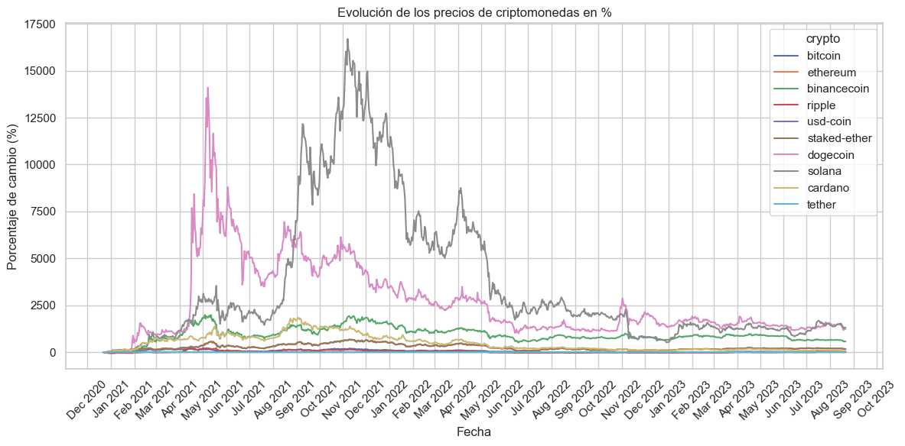
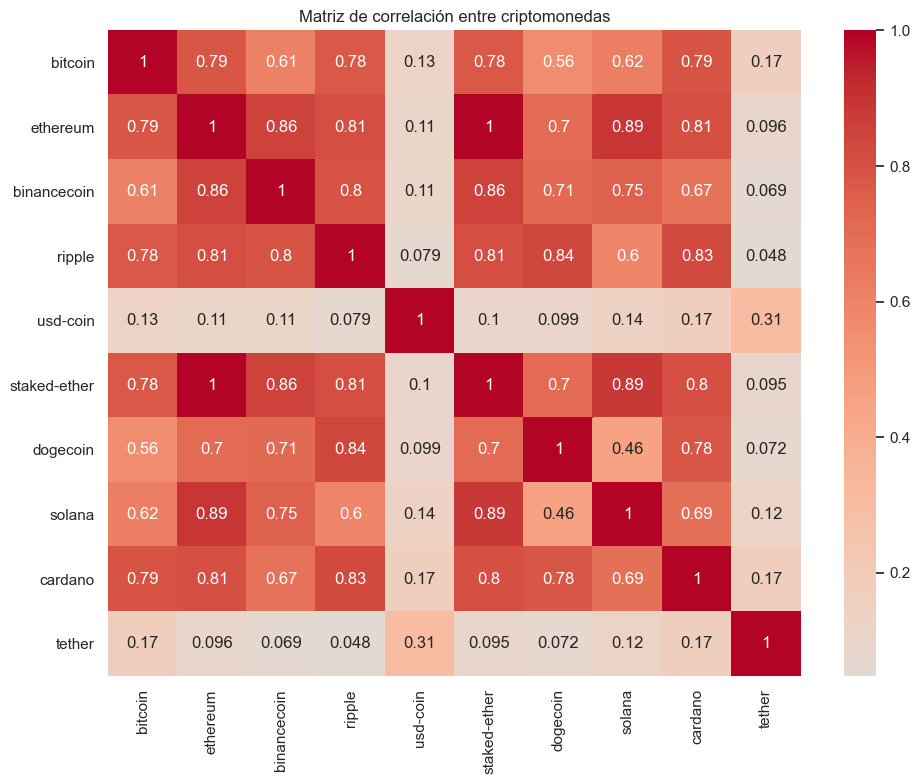
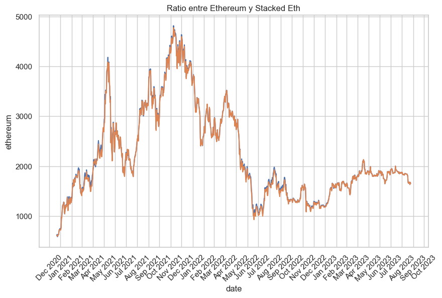
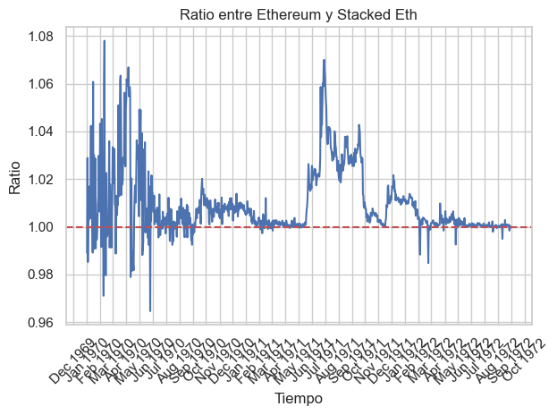
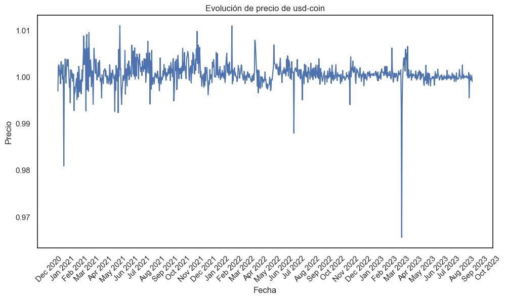
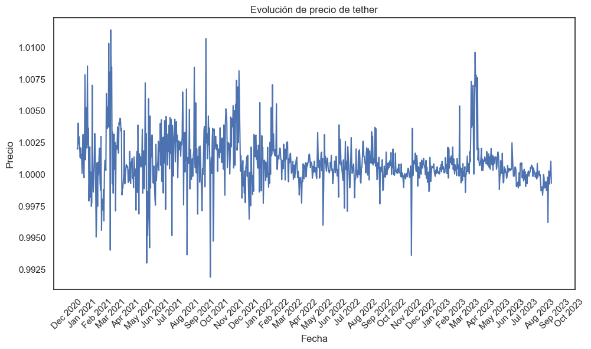
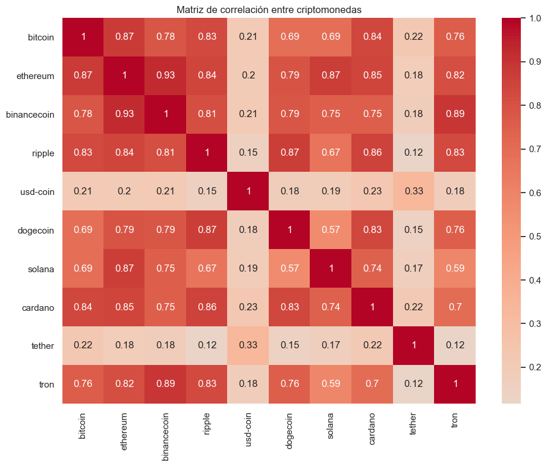
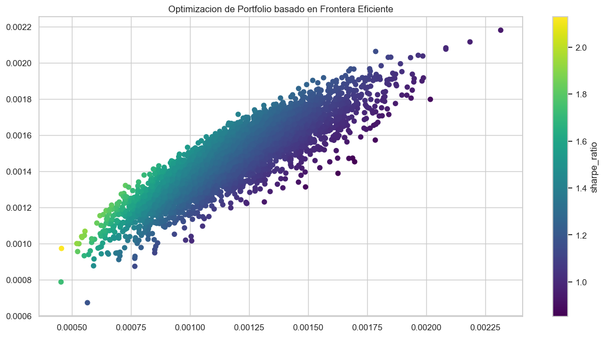
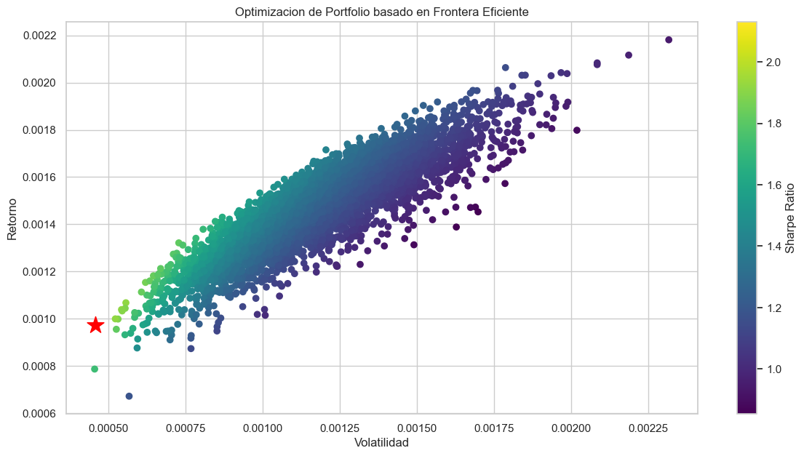
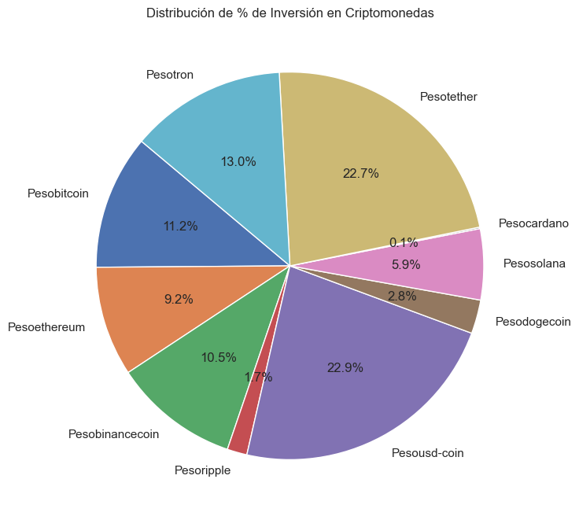

# Proyecto CriptoRisk

En este proyecto, se muestra una cartera de acuerdo al análisis de Cartera Eficiente de Markowtiz. 

Partimos de la base que cualquier inversor desea diversificar sus inversiones, y entre ellas, desea tener fondos dentro del universo cripto. Dado que dichas inversiones cuentan con alta volatilidad más problemas de hackeo (ej. recientemente Exactly) y de fraude por parte de las organizaciones que lo fundan (ej. Luna y su stable coin), es necesario contar con una diversificacion dentro de la oferta de criptomonedas. 

Decidi contar con la información de las 10 monedas que mayor market cap poseen, obtenidas con la API de Coin Gecko. Esta API es gratuita, y permite obtener información de manera diaria de los últimos años. Si bien tiene un limite de requests por minuto, no llegamos al limite dado que necesitaremos correr el sistema para rebalancear la cartera en aproximadamente 1 vez cada 10 días, salvo que se desee realizar de manera manual por algun motivo particular. 

Las 10 monedas con mayor market cap son:
1) Bitcoin
2) Ethereum
3) Binancecoin
4) Ripple
5) Usd-coin
6) Staked-ether 
7) Dogecoin
8) Solana
9) Cardano
10) Tether

### Stacked-ETH Lido vs ETH

Al analizar el comportamiento a traves del tiempo, pudimos ver que las monedas ether y stacked-ether poseen una alta correlación:

Por ello, se decide quitar staked-eth, dado que practicamente por detras, es eth + las recompensas que se obtienen por stackear eth (https://lido.fi/). Se recuerda que el proceso detras de ETH es POS (proof of stake, y que para que te recompense por mantener ETH, debes ser validador y para ello tener al menos 32 ETH; stacked-eth vino a compensar el problema de los que poseen menor cantidad de ETH y quieren cobrar por mantener la moneda; a su vez, tienen liquidez inmediata y no requiere su bloqueo). 
Para el fin de este informe, se retira stacked-eth; podría optarse a responsabilidad del inversor, quitar ETH y dejar stacked-eth en su lugar. 

### Stablecoins

Como se menciono anteriormente, se decidio dejar las monedas stables que surgen como los mayores 10 tokens con mayor market cap. 

Se observa el comportamiento contra moneda dólar de los tokens Usd-Coin y Tether

### 10 Tokens

Luego del analisis y decisión de quitar staked-eth y mantener las 2 stable coins, se decide ingresar a la moneda Solana, la cuál se encuentra en la posición 11va ordenada por market cap.

Se analiza nuevamente la matriz de correlacion, y la misma arroja buenos resultados para lo que buscamos 

## Cartera Eficiente - Harry Markowitz

Harry Markowitz fue un economista estadounidense que recibió el Premio Nobel de Economía en 1990 por su trabajo pionero en la teoría de la cartera. Su trabajo es fundamental para la teoría moderna de la inversión y ha tenido un impacto significativo en el mundo de las finanzas.

La teoría de la cartera de Markowitz se basa en la idea de que los inversores pueden reducir el riesgo de sus inversiones diversificando su cartera. La diversificación implica invertir en una variedad de activos diferentes, lo que ayuda a reducir el impacto de las pérdidas en cualquier activo individual.

Markowitz desarrolló un método para identificar la cartera de inversiones óptima para un inversor dado. Este método, conocido como la frontera eficiente, identifica la cartera que ofrece el mayor rendimiento esperado para un nivel de riesgo dado.

A continuación se presentan algunos de los aportes clave de Markowitz a la teoría de la inversión:

a) El concepto de diversificación como una forma de reducir el riesgo.
b) El desarrollo de la frontera eficiente, que identifica la cartera de inversiones óptima para un inversor dado.
c) El uso de la teoría de la probabilidad para modelar el riesgo de las inversiones.

En este informe, utilizamos Markowitz para ayudar al inversor a crear carteras que satisfagan sus objetivos de inversión y su tolerancia al riesgo.

La curva de cartera eficiente se compone por el rendimiento y la volatilidad. 

La frontera de la cartera se encuentra por la parte superior de la curva. De acuerdo al rendimiento esperado por un cliente, tendra una determinada composición con pesos relativos en cada uno de los activos. 

El ratio Sharpe, se compone de la división entre el rendimiento y la volatilidad. Permite conocer cuál es la cartera que posee la mejor relación. En este caso, se encuentra en el punto de la estrella roja. 

En ese punto, la composición de la cartera se encuentra segmentada de la siguiente manera:

## KPIs
Los KPIs que obtenemos del rendimiento de la inversion, son:

Rendimiento Pesos Relativos:
668.7440283423819

Rendimiento Pesos Proporcionales:
931.8979546577132

Volatilidad total del portafolio de Pesos Relativos:
922.1961783676126

Volatilidad total del portafolio Proporcional:
1385.0494844958425